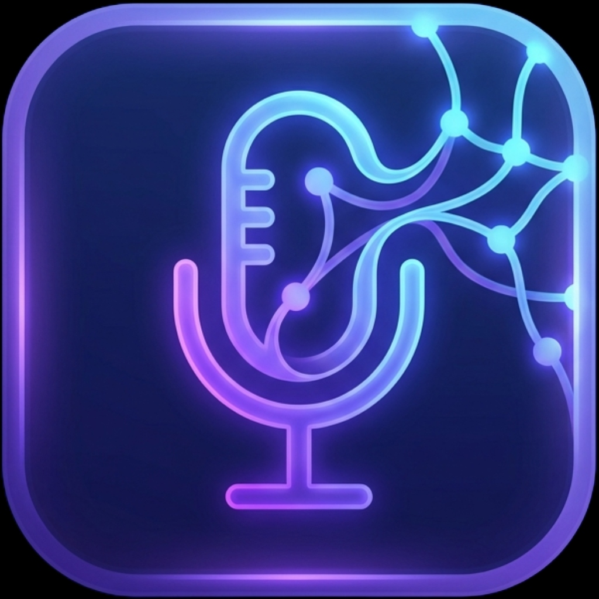

# 🎙️ Dastyor AI - O'zbek Ovozli Yordamchi

<div align="center">



**O'zbekistondagi birinchi offline ovozli yordamchi ilovasi**

[](https://reactjs.org/)
[](https://vitejs.dev/)
[](LICENSE)

[Demo Ko'rish](https://dastyorai.vercel.app) • [APK Yuklab Olish](https://github.com/Jaxongir-Qarshiboyev/Dastyor_AI_Landing_Page/releases/download/v1.0.0-beta/Dastyor-AI-v1.0.0-beta.apk) • [Bog'lanish](mailto:qarshiboyev.jahongir.22.05@gmail.com)

</div>

---

## 📋 Loyiha Haqida

**Dastyor AI** - bu O'zbek tilida 100% offline ishlaydigan ovozli yordamchi ilovasi. Biz an'anaviy Speech-to-Text texnologiyasi o'rniga **Audio Fingerprinting (MFCC + DTW)** dan foydalanamiz, bu esa internet talab qilmaydi va 92%+ aniqlik bilan ishlaydi.

### ✨ Asosiy Xususiyatlar

- 🔒 **100% Offline** - Internet kerak emas
- 🇺🇿 **O'zbek tilida** - To'liq mahalliy til qo'llab-quvvatlash
- ⚡ **Tez** - <500ms javob vaqti
- 🎯 **92%+ Aniqlik** - Ensemble algoritm
- 🔐 **Xavfsiz** - Ma'lumotlar telefondan chiqmaydi

## 🛠️ Texnologiyalar

### Frontend (Landing Page)
- **React 18** - UI framework
- **Vite** - Build tool
- **Framer Motion** - Animatsiyalar
- **Lucide React** - Ikonkalar

### Mobile App (Android)
- **Kotlin** - Dasturlash tili
- **MVVM** - Arxitektura
- **MFCC/DTW** - Audio processing

## 🚀 O'rnatish

```bash
# Repositoryni klonlash
git clone https://github.com/Jaxongir-Qarshiboyev/Dastyor_AI_Landing_Page.git

# Papkaga o'tish
cd Dastyor_AI_Landing_Page

# Dependencylarni o'rnatish
npm install

# Development serverni ishga tushirish
npm run dev
```

## 📦 Build & Deploy

```bash
# Production build
npm run build

# Build preview
npm run preview
```

## 📁 Loyiha Strukturasi

```
dastyor-ai-landing/
├── public/
│   ├── logo.png
│   └── mockup-phone.png
├── src/
│   ├── components/
│   │   ├── Navbar.jsx
│   │   ├── Navbar.css
│   │   ├── ChatBot.jsx
│   │   └── ChatBot.css
│   ├── pages/
│   │   ├── LandingPage.jsx
│   │   ├── LandingPage.css
│   │   ├── DemoPage.jsx
│   │   └── DemoPage.css
│   ├── App.jsx
│   ├── App.css
│   └── main.jsx
├── package.json
└── vite.config.js
```

## 👥 Jamoa

| Ism | Lavozim | Ixtisoslik |
|-----|---------|------------|
| **Abdurasulova Aziza** | Team Lead & CEO | Marketing, Design, Business |
| **Akbarov Ravshanbek** | UI/UX Designer | Frontend Development |
| **Qarshiboyev Jaxongir** | AI/ML Engineer | Android Development |

## 📊 Biznes Model

- **Freemium B2C** - Free/Premium/Pro tariflar
- **B2B Licensing** - Smart Home, IoT, Telecom
- **SDK/API** - Dasturchilar uchun

## 🗺️ Yo'l Xaritasi

- ✅ **2025 Yanvar** - Idea & Research
- ✅ **2025 Fevral** - Prototype
- 🔄 **2026 Fevral** - MVP Development (85%)
- 📅 **2026 Mart** - Beta Launch
- 📅 **2026 Iyun** - Public Release

## 📞 Bog'lanish

- 📧 Email: [qarshiboyev.jahongir.22.05@gmail.com](mailto:qarshiboyev.jahongir.22.05@gmail.com)
- 🌐 Website: [dastyorai.vercel.app](https://dastyorai.vercel.app)
- 🐙 GitHub: [@Jaxongir-Qarshiboyev](https://github.com/Jaxongir-Qarshiboyev)

## 📄 Litsenziya

MIT License - [LICENSE](LICENSE)

---

<div align="center">

**© 2026 Dastyor AI. Barcha huquqlar himoyalangan.**

❤️ Made in Uzbekistan

</div>
